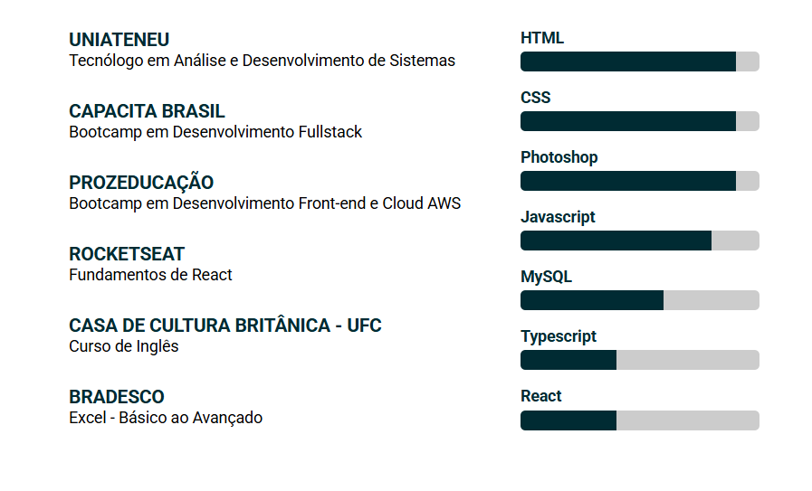
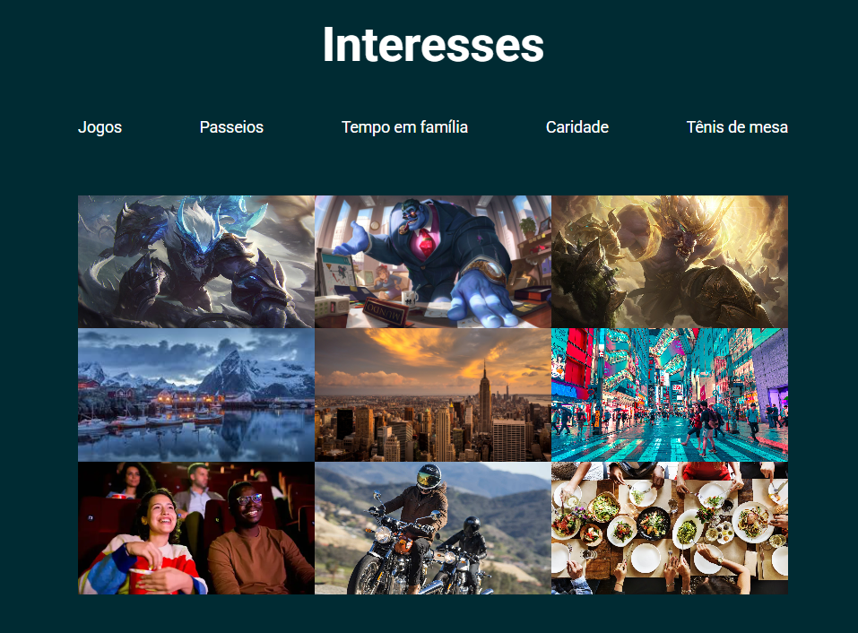
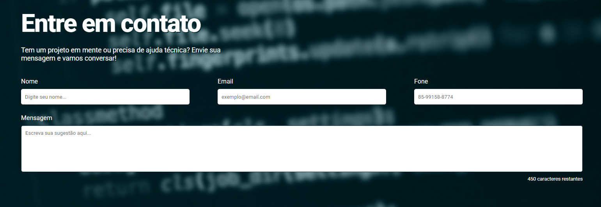
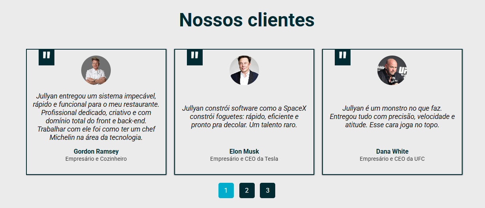

# Projeto-Final-Capacita-Brasil

## Índice
- [O Projeto](#the-project)
- [Imagens](#screenshot)
- [Links](#links)
- [Tecnologia](#tecnologias-e-recursos)

## O Projeto

Projeto final da primeira etapa do módulo full-stack do bootcamp Atlântico Avanti. Um site de portfólio contendo projetos e atuação como desenvolvedor full-stack.

### Links

- Site URL: [Link ativo](https://jullyanvpr.github.io/projeto-final-basico/)

### Screenshots

### Tecnologias e Recursos

- HTML5 semântico
- Flexbox e Grid
- Desktop-first workflow
- Formulários com validação

